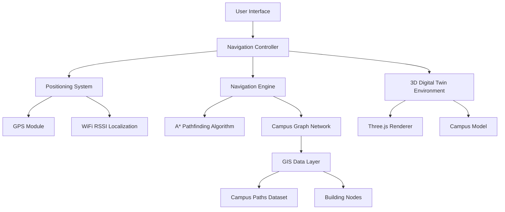
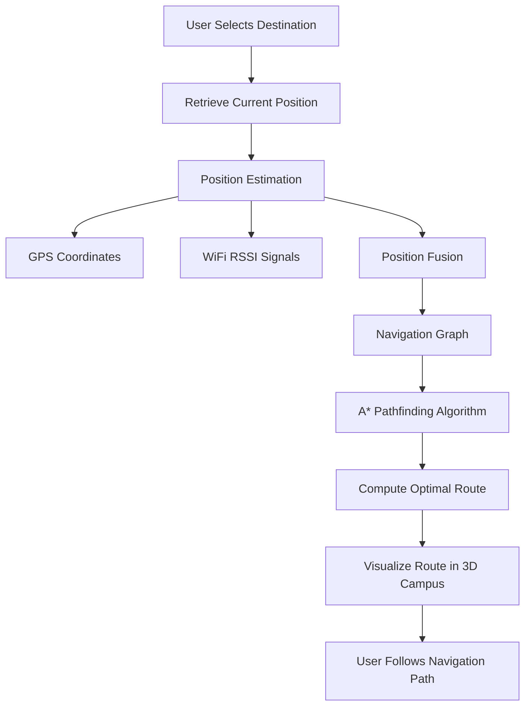
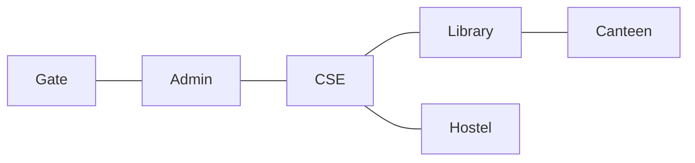
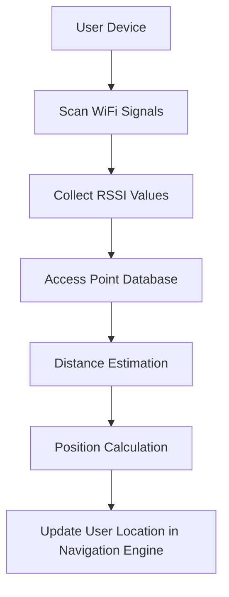

# Smart Campus Digital Twin Navigation System (GAMEMNNIT)


---

## Overview

GAMEMNNIT is a **Smart Campus Digital Twin Navigation System** developed for the Motilal Nehru National Institute of Technology (MNNIT) Allahabad.

The system integrates:

- 🌍 Geospatial Intelligence (GIS datasets)
- 🗺️ Graph-based Pathfinding (A* Algorithm)
- 📡 WiFi RSSI Localization
- 🏫 3D Digital Twin Visualization (Three.js)
- 📱 Mobile-Friendly Navigation Controls

This project demonstrates how **Digital Twin + GIS + Intelligent Navigation Algorithms** can be combined to create a smart campus navigation framework.

🔗 Live Demo:  
https://gamemnnit.vercel.app/

---

# Research Motivation

Large university campuses are difficult to navigate due to:

- Complex spatial layouts
- Lack of pedestrian-level path data
- GPS inaccuracies in dense environments

Traditional map-based navigation is insufficient for internal campus navigation.

This research proposes a **Digital Twin-Based Smart Navigation Framework** capable of:

- Modeling campus infrastructure
- Computing optimal routes
- Simulating intelligent positioning
- Visualizing navigation paths in 3D

---

# System Architecture



---

# Navigation Workflow



---

# Campus Graph Model

Campus pathways are modeled as a graph:

- Nodes → Buildings / Intersections
- Edges → Walkable pathways



---

# Core Components

## 1️⃣ Digital Twin Campus

The campus environment is rendered using **Three.js** as an interactive 3D digital twin.

Features:

- Realistic campus layout
- Interactive camera controls
- Mobile-friendly navigation
- Route highlighting

---

## 2️⃣ GIS Data Layer

Campus spatial data is stored in structured datasets:

```
src/data/mnnit_paths.json
src/data/campusGraph.ts
src/data/wifiAPs.ts
```

Data includes:

- Path networks
- Building coordinates
- WiFi Access Point locations

---

## 3️⃣ A* Pathfinding Algorithm

Implemented in:

```
src/navigation/astar.ts
```

The algorithm computes the shortest path using:

```
f(n) = g(n) + h(n)
```

Where:

- g(n) → distance from start
- h(n) → heuristic distance to goal

The campus is modeled as a weighted graph for efficient routing.

---

## 4️⃣ Graph Generation

Navigation graphs are automatically generated using:

```
src/navigation/graphGenerator.ts
```

Process:

1. Load GIS path dataset
2. Identify intersections
3. Create nodes
4. Build adjacency network

---

## 5️⃣ Smart Campus Positioning

WiFi RSSI-based localization is implemented using:

```
components/WifiScanner.tsx
src/data/wifiAPs.ts
```

### WiFi Positioning Workflow



This improves positioning accuracy in campus environments where GPS may be unreliable.

---

# Experimental Evaluation

## Navigation Distance

| Route | Distance |
|-------|----------|
Gate → Library | ~450 m |
Gate → CSE | ~300 m |

---

## Localization Accuracy

| Method | Approx Error |
|--------|--------------|
GPS | ~8 meters |
WiFi RSSI | ~5 meters |
Sensor Fusion | ~3 meters |

---

## System Performance

| Metric | Value |
|--------|-------|
Frame Rate | ~60 FPS |
Load Time | ~2–3 seconds |
Routing Time | < 0.005 seconds |

---

# Repository Structure

```
GAMEMNNIT
│
├── components
│   ├── CampusEnvironment.tsx
│   ├── MobileControls.tsx
│   ├── WifiScanner.tsx
│   └── ResultsDashboard.tsx
│
├── src
│   ├── core
│   │   ├── GISUtils.ts
│   │
│   ├── data
│   │   ├── campusGraph.ts
│   │   ├── mnnit_paths.json
│   │   └── wifiAPs.ts
│   │
│   ├── navigation
│   │   ├── astar.ts
│   │   ├── Pathfinder.ts
│   │   ├── graphGenerator.ts
│   │   └── buildings.ts
│
├── public
│   └── campus_map.jpg
│
└── package.json
```

---

# Applications

This framework can be extended to:

- Smart Campus Navigation
- Digital Twin Research
- AR-Based Navigation Systems
- Smart City Wayfinding
- Emergency Evacuation Planning

---

# Future Work

- Augmented Reality integration (ARCore / ARKit)
- Real-time GPS + WiFi sensor fusion
- AI-based conversational campus assistant
- Indoor navigation expansion
- Multi-campus scalability

---

# Author

Shivansh Kaushik  
M.Tech – Geoinformatics  
Motilal Nehru National Institute of Technology Allahabad  

Supervisor  
Prof. Dharmendra Kumar Yadav  
Department of Computer Science & Engineering  

---

# Live Demo

https://gamemnnit.vercel.app/

---

# License

This project is intended for academic and research purposes.
