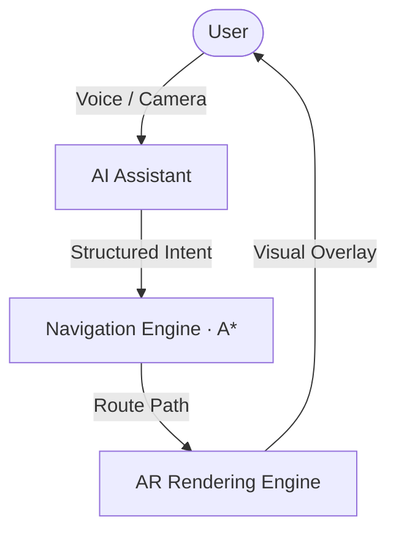
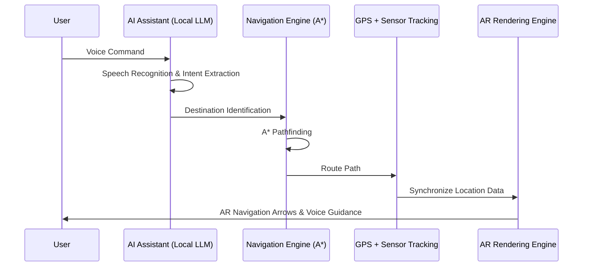
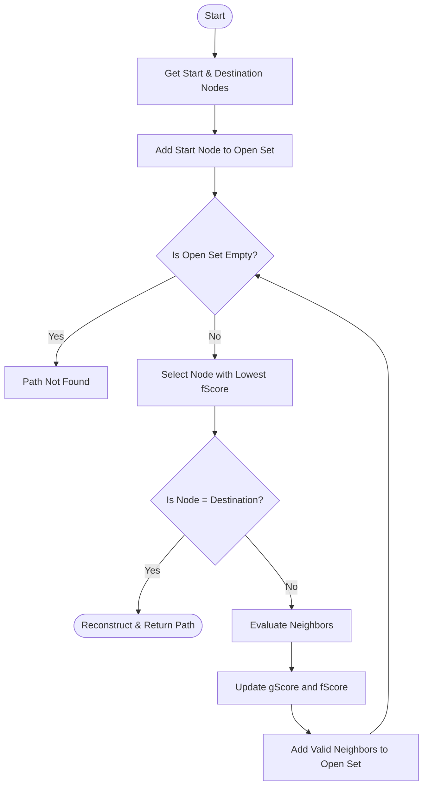

# AR-Based Smart Campus Navigation Using Geospatial Intelligence and Digital Twin Technology

<p align="center">
  <strong>Shivansh Kaushik</strong><br>
  M.Tech Thesis | Motilal Nehru National Institute of Technology (MNNIT) Allahabad<br>
  <em>Research Area: Geospatial Intelligence · Augmented Reality Navigation · Human-Computer Interaction</em>
</p>

<p align="center">
  
  
  
  
  
  
</p>

---

## Table of Contents

1. [Abstract](#1-abstract)
2. [Introduction](#2-introduction)
3. [System Architecture](#3-system-architecture)
4. [Technology Stack](#4-technology-stack)
5. [Digital Twin & Campus Dataset](#5-digital-twin--campus-dataset)
6. [Navigation Engine](#6-navigation-engine)
7. [AR Navigation System](#7-ar-navigation-system)
8. [AI Navigation Assistant](#8-ai-navigation-assistant)
9. [Indoor Positioning](#9-indoor-positioning)
10. [Sensor Integration](#10-sensor-integration)
11. [Evaluation & Results](#11-evaluation--results)
12. [Research Contributions](#12-research-contributions)
13. [Limitations & Future Work](#13-limitations--future-work)
14. [Installation & Setup](#14-installation--setup)
15. [Usage Guide](#15-usage-guide)
16. [Project Structure](#16-project-structure)
17. [References](#17-references)

---

## 1. Abstract

This paper presents the design and implementation of a smart campus navigation system that fuses geospatial mapping, augmented reality (AR), and AI-driven natural language interaction. The system is engineered to reduce the cognitive load of navigating complex, multi-floor university campuses by grounding spatial guidance within a real-time digital twin representation of the environment.

The core routing framework employs the **A\* pathfinding algorithm** operating over a campus-scale graph derived from curated geospatial datasets. Outdoor positioning is handled through GPS, while a conceptual indoor localization framework is proposed using sensor fusion — specifically barometric altimetry and WiFi RSSI fingerprinting. A locally hosted large language model (LLM) via **Ollama** interprets free-form voice commands and translates them into structured navigation intents, which are consumed by the routing engine and rendered as AR directional overlays synchronized to the device's real-world camera perspective.

The resulting prototype, validated on the MNNIT Allahabad campus dataset, demonstrates that the convergence of digital twin visualization, WebXR-based AR, and on-device AI interaction constitutes a viable and extensible framework for next-generation campus wayfinding.

---

## 2. Introduction

Modern university campuses are increasingly adopting *smart campus* paradigms, where digital infrastructure augments physical accessibility, mobility, and information delivery. Yet despite widespread GPS-based routing, navigation within dense campus environments remains cognitively demanding — particularly for first-year students and visitors who must locate specific building entrances, laboratory floors, or departmental offices within large multi-story structures.

Existing two-dimensional map interfaces, while effective at city scale, impose a recurring **context-switching penalty**: users must repeatedly translate abstract map representations into real-world spatial decisions, interrupting their physical movement and situational awareness.

This project proposes a departure from flat-map navigation toward an **immersive, context-aware spatial guidance system** built on three technological pillars:

1. **Digital Twin** — a live, spatially accurate 3D model of the campus serving as the navigational ground truth.
2. **Augmented Reality** — directional overlays that are projected into the device camera feed, anchoring guidance cues directly within the user's visual field.
3. **AI-Driven Voice Interaction** — a locally hosted LLM that accepts natural language commands and resolves them into precise routing instructions.

### 2.1 Problem Statement

Navigating expansive, multi-layered university campuses imposes significant cognitive load on visitors and new students. While outdoor movement is generally supported by standard GPS applications, the transition from macro-level routing to micro-level indoor destinations — such as specific laboratories or departmental floors — remains a largely unsolved challenge in the web-native application space. The constant context-switching between a 2D map interface and the physical environment reduces situational awareness. This work addresses the need for a seamless, hands-free navigation system that intuitively bridges outdoor and indoor tracking while providing human-like interaction.

---

## 3. System Architecture

The system follows a **modular, decoupled architecture** that separates visualization, routing, sensor integration, and AI inference into independent processing units. This design prevents computationally intensive operations — such as 3D rendering, pathfinding, and LLM inference — from blocking one another.

The system comprises five primary modules: the Digital Twin Layer, Navigation Engine, AR Visualization Layer, AI Assistant Module, and Indoor Positioning Module.

### 3.1 High-Level Architecture


```mermaid
graph TD
    User([User]) -->|Voice / Camera| AI[AI Assistant]
    AI -->|Structured Intent| Nav[Navigation Engine · A*]
    Nav -->|Route Path| AR[AR Rendering Engine]
    AR -->|Visual Overlay| User
```

### 3.2 End-to-End System Workflow


```mermaid
sequenceDiagram
    participant User
    participant AI as AI Assistant (Local LLM)
    participant Nav as Navigation Engine (A*)
    participant Sens as GPS + Sensor Tracking
    participant AR as AR Rendering Engine

    User->>AI: Voice Command
    AI->>AI: Speech Recognition & Intent Extraction
    AI->>Nav: Destination Identification
    Nav->>Nav: A* Pathfinding
    Nav->>Sens: Route Path
    Sens->>AR: Synchronize Location Data
    AR->>User: AR Navigation Arrows & Voice Guidance
```

---

## 4. Technology Stack

| Category | Technologies |
|---|---|
| **Frontend Framework** | React 18, TypeScript, Vite |
| **3D & Mapping** | Three.js, React Three Fiber (R3F), Drei, Mapbox GL JS, OpenStreetMap API |
| **AR & Sensors** | HTML5 Canvas 2D Overlay, WebXR Device API, Geolocation API, DeviceOrientation API, AbsolutePressureSensor |
| **AI & NLP** | Ollama (Local LLM Server), Web Speech API (SpeechRecognition & SpeechSynthesis) |
| **Backend & Auth** | Appwrite (BaaS) — user authentication, voxel placement persistence |
| **Routing** | Custom A\* pathfinding implementation |

---

## 5. Digital Twin & Campus Dataset

The Digital Twin environment (`src/three/`) functions as the **spatial source of truth** for the entire system. It dynamically fetches real-world building boundaries and extrudes them into navigable 3D geometry based on a curated multi-source campus dataset.

### 5.1 Dataset Sources

- **OpenStreetMap (OSM)** — Building footprints and macro-topological features.
- **Overpass API** — Live geographic queries extracting geometric polygons on demand.
- **Annotated Waypoints** — Manually surveyed GPS coordinates for sub-node destinations (e.g., *Computer Science Department, Floor 1*).
- **GeoJSON Path Network** — A custom-drawn, traversable vector map representing specific pedestrian and vehicular pathways on the MNNIT campus.

### 5.2 Implementation Details

- **`MapboxGround.tsx`** — Renders satellite tile layers and real-world topological references beneath the campus 3D geometry.
- **`fetchOSMBuildings.ts`** — Queries the Overpass API to retrieve building footprints, which are triangulated and rendered as interactive 3D meshes in Three.js.
- **`coordinateTransform.ts`** — Implements a bidirectional affine transformation matrix that maps raw GPS geographic coordinates `(Lat, Lon)` into the Digital Twin's Cartesian space `(X, Y, Z)`.

---

## 6. Navigation Engine

Campus routing is implemented using the **A\* search algorithm** operating on a graph derived from the GeoJSON pedestrian and vehicular network dataset.

Each **node** represents a spatial waypoint — a pathway intersection, building entrance, or route junction. Each **edge** encodes a traversable connection between adjacent nodes.

### 6.1 Algorithm

The A\* algorithm evaluates candidate routes by minimizing the combined cost function:

$$f(n) = g(n) + h(n)$$

where:
- $g(n)$ — the exact cost of the path from the origin to node $n$
- $h(n)$ — an admissible heuristic estimate of the remaining cost from $n$ to the goal

The heuristic used is **Euclidean distance** in the projected Cartesian coordinate system:

$$h(n) = \sqrt{(x_n - x_{goal})^2 + (z_n - z_{goal})^2}$$

### 6.2 Algorithm Flowchart


```mermaid
graph TD
    Start([Start]) --> GetStart[Get Start & Destination Nodes]
    GetStart --> AddStart[Add Start Node to Open Set]
    AddStart --> Loop{Is Open Set Empty?}
    Loop -- Yes --> Fail[Path Not Found]
    Loop -- No --> Select[Select Node with Lowest fScore]
    Select --> CheckGoal{Is Node = Destination?}
    CheckGoal -- Yes --> Done([Reconstruct & Return Path])
    CheckGoal -- No --> Neighbors[Evaluate Neighbors]
    Neighbors --> Update[Update gScore and fScore]
    Update --> AddOpen[Add Valid Neighbors to Open Set]
    AddOpen --> Loop
```

### 6.3 Core Implementation

```typescript
// src/navigation/astar.ts
function heuristic(a: Node, b: Node): number {
    return Math.sqrt((a.x - b.x) ** 2 + (a.z - b.z) ** 2);
}
// Nodes are evaluated iteratively via an OpenSet optimized for lowest fScore.
```

The GeoJSON `LineString` features are parsed to generate an adjacency list (`Record<string, string[]>`), with nodes keyed by their coordinate-derived identifiers.

---

## 7. AR Navigation System

The AR interface provides **visual guidance by projecting directional indicators onto the live device camera feed**, allowing users to follow navigation cues without consulting a separate map.

### 7.1 AR Pipeline

1. The device camera stream is acquired via the `getUserMedia` API.
2. A transparent `<canvas>` layer is composited above the video stream.
3. GPS location and device orientation (compass bearing) are polled continuously.
4. The system computes the relative bearing from the user's current position to the next waypoint.
5. Directional arrows are rendered on the canvas, aligned to the user's viewing direction.

Only nearby waypoints are rendered at any given time to minimize visual clutter and maintain responsiveness during real-time movement.

---

## 8. AI Navigation Assistant

The AI assistant provides a **conversational, voice-first interface** for initiating and adjusting navigation tasks. Supported commands include natural phrasing such as:

> *"Guide me to the Computer Science Department"*
> *"Take me to the Admin Building"*

### 8.1 Processing Pipeline

1. Voice input is captured by the browser's **Web Speech API** (`SpeechRecognition`) and transcribed to text.
2. The transcribed query is sent to a **locally hosted LLM** via the Ollama API endpoint.
3. The model is prompted to emit only **structured JSON** containing the extracted intent and resolved destination — enabling reliable programmatic integration with the routing engine.
4. The routing engine computes the path, and turn-by-turn instructions are spoken aloud via the **SpeechSynthesis API**.

This design deliberately avoids reliance on cloud-based NLP APIs, keeping all AI inference on-device and eliminating network latency for intent resolution.

---

## 9. Indoor Positioning

GPS signal degrades significantly within reinforced concrete structures, necessitating a **hybrid fallback localization mechanism** (`src/indoor/`).

### 9.1 Barometric Altimetry

Floor height is estimated from ambient atmospheric pressure using the standard barometric formula:

$$h = 44330 \times \left(1 - \left(\frac{P}{P_0}\right)^{\frac{1}{5.255}}\right)$$

where $P$ is the pressure reading from the device sensor and $P_0$ is the calibrated sea-level reference pressure. A floor transition event is triggered when the vertical displacement $\Delta h \geq 3.0\ \text{m}$.

### 9.2 WiFi RSSI Fingerprinting

Indoor position is estimated using the path-loss propagation model:

$$\text{RSSI} = -10 \times n \times \log_{10}(d) + A$$

where $n$ is the path-loss exponent, $d$ is the estimated distance to the access point, and $A$ is the received signal strength at 1 m reference distance.

The module `wifiFingerprint.ts` implements a **Euclidean distance matching algorithm** that compares live RSSI arrays against pre-calibrated multi-floor spatial signature databases for the Academic and Administrative buildings.

---

## 10. Sensor Integration

| Sensor | API | Role |
|---|---|---|
| GPS | `navigator.geolocation` | Primary macro-level outdoor positioning |
| Accelerometer / Gyroscope | `devicemotion` | Motion boundary detection for step-event filtering |
| Magnetometer | `deviceorientation` | Compass bearing for AR alignment to True North |
| Barometer | `AbsolutePressureSensor` (Generic Sensor API) | Vertical floor transition detection |

---

## 11. Evaluation & Results

The prototype was validated on the **MNNIT Allahabad campus dataset** across real-world outdoor traversal conditions.

### 11.1 Performance Metrics

| Metric | Achieved | Target |
|---|---|---|
| A\* Route Generation Time | **< 50 ms** | < 100 ms |
| AR Rendering Frame Rate | **30–60 FPS** | ≥ 30 FPS |
| GPS Positioning Accuracy | **~5–10 m** | ± 5 m |
| Barometric Floor Detection | **± 1 floor** | ± 1 floor |
| LLM Intent Extraction Latency | **~800 ms** | < 1.5 s |

### 11.2 Identified Design Challenges

**Sensor Noise & Calibration** — Consumer-grade smartphone compasses and GPS units exhibit significant environmental interference (e.g., multipath effects near concrete structures), making stable AR anchor alignment difficult under real-world conditions.

**Browser Security Constraints** — Access to low-level hardware — particularly background WiFi scanning for RSSI fingerprinting — is restricted by modern browser security policies, necessitating native application wrappers for production deployment.

**LLM Latency Trade-offs** — On-device generative AI inference requires careful balancing of model parameter count against real-time responsiveness. The Gemma 2B model was selected as a practical compromise for the current prototype.

---

## 12. Research Contributions

1. **Pure-web AR Navigation Interface** — A fully browser-native augmented reality direction system decoupled from proprietary operating system frameworks, implemented using WebXR and the HTML5 Canvas API.

2. **Discrete-to-Generative AI Bridge** — A novel integration methodology that feeds discrete A\* graph node outputs into a locally hosted generative language model, enabling natural language reasoning over structured spatial data without exposing raw graph internals to the model.

3. **Hybrid Indoor-Outdoor Architecture** — A unified client-side framework combining theoretical indoor localization mathematics (RSSI fingerprinting, barometric altimetry) with outdoor GIS data sources (OSM, Mapbox) within a single React application payload.

---

## 13. Limitations & Future Work

### 13.1 Current Limitations

- The AR overlay relies exclusively on GPS and device compass orientation (3DoF). The absence of visual odometry or SLAM-based pose estimation results in observable drift when sensors are uncalibrated.
- Background WiFi scanning for RSSI fingerprinting cannot be executed via browser protocols alone; a native shell (Android/Flutter) is required for production indoor localization.
- Barometric floor detection is sensitive to daily atmospheric pressure fluctuations and requires periodic ground-truth recalibration.

### 13.2 Future Directions

- **Visual Positioning Systems (VPS)** — Integrating OpenCV/WebAssembly to perform building facade recognition from the device camera, replacing dependence on magnetometer-based orientation.
- **SLAM Navigation** — Adopting Simultaneous Localization and Mapping for millimeter-accurate indoor tracking within architecturally complex structures such as libraries.
- **Native Wrappers** — Migrating `src/indoor/` and `src/sensors/` into a dedicated Flutter or React Native shell to unlock background WiFi scanning and richer hardware sensor access.

---

## 14. Installation & Setup

**Prerequisites:** Node.js v18+, npm or yarn.
Ollama is optional and required only for AI assistant features.

### Step 1 — Clone & Install

```bash
git clone https://github.com/your-username/smart-campus-nav.git
cd smart-campus-nav
npm install
```

### Step 2 — Download Local AI Model *(Optional)*

```bash
ollama run gemma:2b
```

### Step 3 — Configure Environment Variables

Create a `.env` file in the project root:

```env
VITE_MAPBOX_TOKEN=pk.your_mapbox_token_here
```

### Step 4 — Start Development Server

```bash
npm run dev
```

Navigate to `http://localhost:3000`. Note: sensor APIs (camera, geolocation, DeviceOrientation) require an **HTTPS** context or `localhost`.

---

## 15. Usage Guide

| Mode | Description |
|---|---|
| **Digital Twin Mode** | Pan and orbit the 3D Mapbox/Voxel campus. Click markers to query building metadata. |
| **Real Map Mode** | Classic top-down navigation UI displaying live A\* route segments over Mapbox satellite imagery. |
| **AR Navigation Mode** | Select a destination and enter camera view. AR arrows snap to the floor plane and indicate turns in real time. |
| **AI Assistant** | Inside the AR tab, tap *Voice Command* and speak a natural destination query (e.g., *"Guide me to the Computer Science Department"*). |
| **WiFi / Indoor Mode** | View the sensor fusion telemetry dashboard. In a native shell, observe real-time floor changes as RSSI network signatures shift. |

---

## 16. Project Structure

```
src/
├── ai/             # Local LLM bridge, NLP intent parsing, voice synthesis
├── ar/             # WebXR camera hooks, GPS-to-AR world matrix transforms
├── components/     # React functional UI layers (mobile controls, inventory, tabs)
├── core/           # Appwrite auth, coordinate transforms, OSM integrations
├── data/           # GeoJSON mapping boundaries, pathing datasets
├── indoor/         # Barometer fusion, hybrid floor detection algorithms
├── localization/   # Abstraction layer for location services
├── navigation/     # A* algorithm, pathfinding logic, building registries
├── pages/          # Application states (RealMap, VoxelCampus, ARPage, WifiTab)
├── sensors/        # Raw hardware bindings (GPS, WiFi logic simulators)
├── three/          # Digital Twin sub-components for React Three Fiber renders
└── wifi/           # Floor fingerprinting, RSSI mathematics, Network Information API
```

---

## 17. References

1. Hart, P. E., Nilsson, N. J., & Raphael, B. (1968). A Formal Basis for the Heuristic Determination of Minimum Cost Paths. *IEEE Transactions on Systems Science and Cybernetics*, 4(2), 100–107.
2. Azuma, R. T. (1997). A Survey of Augmented Reality. *Presence: Teleoperators and Virtual Environments*, 6(4), 355–385.
3. Bahl, P., & Padmanabhan, V. N. (2000). RADAR: An In-Building RF-Based User Location and Tracking System. *IEEE INFOCOM 2000*. Tel Aviv, Israel.
4. Mapbox GL JS API Documentation. (2024). Mapbox Technologies.
5. React Three Fiber Documentation. (2024). Poimandres Open Source.

---

## License

This project is licensed under the [MIT License](LICENSE).

---

<p align="center">
  <em>Submitted in partial fulfillment of the requirements for the degree of Master of Technology</em><br>
  <strong>Motilal Nehru National Institute of Technology Allahabad</strong>
</p>