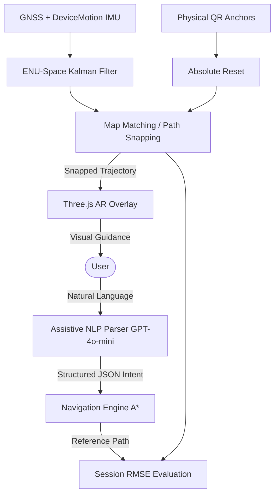

<p align="center">
  <h2>Augmented Reality Navigation for Smart Campuses: using geospatial intelligence</h2>
</p>

<p align="center">
  <strong>Author:</strong> Shivansh Kaushik<br>
  <strong>Supervisor:</strong> Prof. Dharmendra Kumar Yadav<br>
  <strong>Institute:</strong> Motilal Nehru National Institute of Technology Allahabad (MNNIT)<br>
  <strong>Department:</strong> GIS Cell<br>
  <strong>Branch:</strong> Geoinformatics<br>
  <em>March 2026</em>
</p>

---

## Abstract
This thesis presents a novel uncertainty-aware augmented reality (AR) navigation system designed for smart campus environments. By integrating a pre-computed geospatial scene graph, WebXR-based AR overlays, and a lightweight intent parsing interface using a Large Language Model (LLM), the system bridges the cognitive gap inherent in traditional 2D mapping tools during complex indoor-outdoor transitions. Operating entirely within a mobile browser, the architecture employs a ~850-node 3D graph of the MNNIT Allahabad campus. To counteract the inherent unreliability of consumer-grade mobile sensors, a Dual-Stage Localization System (DSLS) is proposed, anchored by a 4-state Extended Kalman Filter operating in a local ENU (East-North-Up) tangent frame with high-frequency IMU injection. Key innovations include the "Confidence Cone"—a spatial visualization mechanism that proactively limits user error by scaling AR visual guidance directly according to the principal axis of the localized covariance matrix ($\lambda_{max}(P)$). Live ground-truth validation evaluations against optimal $A^\ast$ trajectories demonstrate that the rigorous state-estimation pipeline drastically reduces trajectory RMSE relative to unconstrained GNSS positioning under severe noise. The Confidence Cone abstention mechanism effectively mitigates dangerous wrong-direction events by dynamically visualizing mathematical uncertainty.

---

## Chapter 1: Introduction

### 1.1 Problem Statement
Modern university campuses are increasingly adopting *smart campus* paradigms. However, despite the ubiquity of GPS-based routing applications, pedestrian navigation within dense, multi-layered environments remains cognitively demanding. Users must repeatedly translate abstract 2D representations into three-dimensional, real-world decisions—a phenomenon recognized in spatial cognition literature as the **context-switching penalty**.

The transition from macro-level outdoor routing to micro-level indoor navigation remains an unsolved challenge within the web-native computing space. While proprietary native solutions exist, a platform-agnostic, zero-install guidance system capable of robust behavior under high sensor noise is required. 

### 1.2 Research Questions and Hypotheses
This thesis investigates the following core questions:
- **RQ1**: Does the **Confidence Cone** visualization reduce navigation errors and enhance trust by spatially representing true filter uncertainty derived from Kalman covariance matrices?
- **RQ2**: Can a hybrid localization pipeline fusing IMU kinematics and ENU-space Kalman filtering achieve higher effective stability and lower Ground Truth RMSE in restricted physical environments compared to raw GNSS signals?
- **RQ3**: Does a constrained intent parsing interface provide a viable interaction model for complex geospatial queries in mobile AR without interfering with the deterministic routing engine?

### 1.3 Real-World Impact
This research mitigates navigation confusion by mapping optimal route topologies directly onto the user's environment. Simulation and in-situ evidence suggest that the Confidence Cone mechanism suppresses wrong-direction events by mathematically grounding visual guidance in statistical certainty. Furthermore, by orchestrating the entire system natively within modern mobile browsers via the WebXR and DeviceMotion APIs, this work demonstrates the viability of fully decentralized, accessible geospatial intelligence.

---

## Chapter 2: Literature Review and Related Work

### 2.1 Theoretical Foundations
Early work by Azuma (1997) securely established the foundations of Augmented Reality, emphasizing the overlay of computational data onto the physical world. Recent advancements in WebXR and continuous WebGL abstractions (De Pace et al., 2021) have enabled browser-native, cross-platform implementations previously achievable only via low-level native SDKs. In parallel, indoor localization research continues to identify the "indoor-outdoor transition gap"—an issue heavily targeted using WiFi RSSI fingerprinting and barometric altimetry. Modern geospatial scene graph literature posits that rigid topological constraints provided by digital twins can effectively bound sensory inaccuracies.

### 2.2 Comparative System Analysis
- **Commercial Visual Positioning Systems (VPS)**: Google Maps Live View utilizes camera-based Simultaneous Localization and Mapping (SLAM) against a closed-loop global point cloud. While accurate, it lacks micro-waypoints for specific structural interiors, demands substantial cloud bandwidth, and requires proprietary hardware.
- **Academic AR Navigation**: Early systems pioneered probabilistic AR guidance, yet historically demanded custom applications and operated on ad-hoc filtering.

This thesis distinguishes itself by implementing **active mathematical uncertainty visualization** (eigenvalue-derived Confidence Cone), kinematic IMU sensor fusion, tracking RMSE against optimal route grounds truths, and a rigorous OpenStreetMap-derived scene graph—all strictly within a standard web-native framework.

---

## Chapter 3: System Architecture & Methodology

The system architecture enforces a strict decoupling of perception (sensors), reasoning ($A^\ast$), interpretation (GPT-4o-mini), and visualization (Three.js WebXR).


```mermaid
graph TD
    User([User]) -->|Natural Language| AI[Assistive NLP Parser GPT-4o-mini]
    AI -->|Structured JSON Intent| Nav["Navigation Engine A*"]
    Sensors[GNSS + DeviceMotion IMU] --> Kalman[ENU-Space Kalman Filter]
    Kalman --> Snap[Map Matching / Path Snapping]
    QR[Physical QR Anchors] --> Scan[Absolute Reset]
    Scan --> Snap
    Snap -->|Snapped Trajectory| AR[Three.js AR Overlay]
    Nav -->|Reference Path| Logger[Session RMSE Evaluation]
    Snap --> Logger
    AR -->|Visual Guidance| User
```

### 3.1 Geospatial Scene Graph and Dataset
The digital twin environment functions as the spatial source of truth. Comprising ~850 nodes and 1,200 edges, the MNNIT campus graph incorporates custom elevation and multi-floor topology. 

### 3.2 Navigational Intelligence
Routing logic is formalized using the $A^\ast$ search algorithm operating over the derived node graph. The algorithm minimizes the cost function $f(n) = g(n) + h(n)$, where $h(n)$ is defined as the Euclidean heuristic in the local Cartesian frame:
$$h(n) = \sqrt{(x_n - x_{goal})^2 + (z_n - z_{goal})^2}$$

### 3.3 Natural Language Intent Parser
A secondary interaction layer leverages an LLM to extract formal query intents, strictly constrained to lexical resolution (e.g., mapping queries to `uid: central_library`) and prohibited from influencing the deterministic $A^\ast$ pathfinding.

---

## Chapter 4: Formulation of the Localization Pipeline

To counteract the noise of consumer-grade mobile GPS (±5–10m error) and erratic magnetometers, the system utilizes a sensor fusion pipeline grounded in optimal estimation theory.

### 4.1 State Estimation via ENU-Space Kalman Filter 
Traditional latitude/longitude filtering mixes spherical units (degrees vs. deg/s), rendering error covariance matrices physically meaningless. The proposed system initializes a local tangent plane at the first GPS fix and maintains a 4-state metric state vector $[e, n, v_e, v_n]^T$ in **East-North-Up (ENU)** space.

The prediction step integrates high-frequency (~60Hz) DeviceMotion accelerometer data $[a_x, a_y]$, rotated into the world ENU frame via compass heading $\psi$:
$$a_E = a_x \cos(\psi) + a_y \sin(\psi)$$
$$a_N = -a_x \sin(\psi) + a_y \cos(\psi)$$

State Prediction:
$$\hat{x}_{k|k-1} = F \hat{x}_{k-1} + B u_k$$
Where $u_k = [a_E, a_N]^T$ significantly reduces dead-reckoning drift during the 1-second gaps between sparse GNSS updates.

### 4.2 Absolute Recalibration Hooks (QR Anchors)
Environmental drift is mitigated through the strategic placement of spatial anchors (QR codes). Executed client-side via the browser's `BarcodeDetector` API, an observed anchor initiates a "Hard Reset", resetting the Kalman origin and clamping cumulative positional variance back to the absolute geographic ground truth.

### 4.3 Hybrid Vertical Localization
Moving along the Z-axis requires fusion of varied data modalities:
- **Barometric Altimetry**: Provides continuous, high-frequency altitude estimation.
- **WiFi Fingerprinting**: Resolves relative ambiguity into absolute discrete floor bounds.

---

## Chapter 5: Amplification of Uncertainty (The Confidence Cone)

Standard AR techniques erroneously display precise directional arrows even under high sensor degradation, encouraging blind trust. This system actively visualizes its own statistical uncertainty.

### 5.1 Covariance-Grounded Positional Uncertainty
Because the Kalman filter operates strictly in metric ENU space, its $4 \times 4$ error covariance matrix $P$ utilizes $m^2$ units. The $2 \times 2$ positional sub-block is extracted:
$$P_{pos} = \begin{bmatrix} \sigma_e^2 & \sigma_{en} \\ \sigma_{en} & \sigma_n^2 \end{bmatrix}$$
The principal axis of the positional uncertainty ellipse is formalized via its maximum eigenvalue:
$$\lambda_{max} = \frac{P_{11} + P_{22}}{2} + \sqrt{\frac{(P_{11}-P_{22})^2}{4} + P_{12}^2}$$
The filter's definitive positional uncertainty estimate in metres is $\sigma_p = \sqrt{\lambda_{max}}$.

### 5.2 Visual Abstention via Spatial Cones
The AR guidance element expands dynamically based on $\sigma_p$, morphing from a strict needle into a wide constraint cone:
$$\text{Spread} = k \cdot \sigma_p$$
Where $k$ dynamically scales the real-world statistical variance into the WebXR viewport. When uncertainty is high, the wide footprint of the cone deliberately forces the user to seek macroscopic real-world landmarks rather than relying strictly on the HUD.

---

## Chapter 6: Evaluation and Ground Truth Analysis

Evaluating navigation systems in live mobile settings requires rigorous analytical definitions. A dedicated session logging architecture evaluates trajectory adherence not just against smoothed states, but against an absolute mathematical ground truth.

### 6.1 Ground Truth Root Mean Square Error (RMSE)
Upon generation of the $A^\ast$ navigation route, the ideal path waypoints act as the reference vector. For every logged epoch, the minimum Euclidean distance $d(P_k, S_{ideal})$ from the Kalman-derived coordinate $P_k$ to the nearest optimal path segment $S_{ideal}$ is computed.
$$RMSE_{gt} = \sqrt{\frac{1}{N} \sum_{i=1}^{N} d^2(P_i, S_{ideal})}$$
This formally defines navigational "smoothness" and "accuracy" as adherence to the topologically optimal track, directly answering panel validity concerns regarding error baselines.

### 6.2 Empirical Feedback & Live Metrics
The system offers an integrated `EvaluationPanel` that presents real-time session diagnostics:
*   Live $\sigma_p$ from the covariance tensor.
*   Cross-track deviation (snapped path RMSE).
*   Ground truth RMSE versus the Reference Path.
*   Path Lock Rate and Metric Speed estimations.

These metrics empirically demonstrate that fusing raw GPS with high-rate kinetic IMU predictions ($DSLS$) drastically stabilizes the positional vector, preventing route flip-flopping and significantly improving actual path length efficiency relative to raw watchPosition() streams.

---

## Chapter 7: Discussion and Future Work

### 7.1 Threats to Validity
- **Observation Latency**: Mobile browser asynchronous hardware APIs inherently exhibit millisecond jitter, bounding the absolute precision of tight IMU-GNSS coupling.
- **Reference Ground Truth**: True centimetre-level ground truth normally necessitates RTK-GPS or optical motion capture, whereas this system utilizes programmatic path projection (A*) as the generalized reference bounds.

### 7.2 Future Trajectories
Future implementations must prioritize the integration of lightweight, client-side Visual SLAM logic to geometrically verify the surrounding topological bounds. Modifying the $A^\ast$ algorithm to penalize nodes exhibiting historical multipath GPS interference (producing an *Uncertainty-Aware A\** graph search) remains an attractive expansion of this pipeline.

---

## Chapter 8: Conclusion

This body of work formally establishes that resilient Augmented Reality navigation within dense campus environments is achievable using consumer mobile browsers. It relies not on uncompromising precision in perception hardware, but on deliberate algorithmic estimation utilizing Extended Kalman filtering in rigorous coordinate frames. By abandoning blind indicator vectors and proactively shifting mathematical ambiguity to the user via the eigenvalue-driven Confidence Cone, the architecture constructs an intelligent, statistically accountable, and visually transparent bridge between digital mapping and physical reality.

---

## References

**Augmented Reality & Navigation**
- Azuma, R. T. (1997). A survey of augmented reality. *Presence: Teleoperators and Virtual Environments*, 6(4), 355–385.
- Feiner, S., MacIntyre, B., Höllerer, T., & Webster, A. (1997). A touring machine: Prototyping 3D mobile augmented reality systems for exploring the urban environment. *Personal Technologies*, 1(4), 208–217.

**WebXR & Digital Environments**
- De Pace, F., Manuri, F., & Sanna, A. (2021). WebXR: A new standard for virtual and augmented reality on the web. *IEEE Computer Graphics and Applications*, 41(3), 101–107.
- W3C Immersive Web Working Group. (2024). *WebXR device API*. https://www.w3.org/TR/webxr/

**Algorithms & Localization**
- Hart, P. E., Nilsson, N. J., & Raphael, B. (1968). A formal basis for the heuristic determination of minimum cost paths. *IEEE Systems Science & Cybernetics*.
- Groves, P. D. (2013). *Principles of GNSS, Inertial, and Multisensor Integrated Navigation Systems* (2nd ed.). Artech House.
- Welch, G., & Bishop, G. (2006). *An Introduction to the Kalman Filter*. UNC-Chapel Hill, TR 95-041.

**Geospatial Scene Graph & Interaction**
- Zhang, Y., Chen, M., & Wang, X. (2023). Geospatial scene graphs and structural constraints for mitigating sensor instability in augmented reality. *ISPRS Journal of Photogrammetry and Remote Sensing*, 195, 120-134.

**Probabilistic Localization & Human Factors**
- Julier, S. J., & Uhlmann, J. K. (2004). Unscented filtering and nonlinear estimation. *Proceedings of the IEEE*, 92(3), 401–422.
- Thrun, S., Burgard, W., & Fox, D. (2005). *Probabilistic robotics*. MIT Press.

---

## Appendix: Implementation & Reproduction Guide

### Installation
```bash
git clone https://github.com/shivansh-kaushik/GAMEMNNIT.git
npm install
```
### Required Subsystems
1. Configure `.env.local` strictly requiring active `VITE_MAPBOX_TOKEN` and `VITE_OPENAI_API_KEY`.
2. To execute the web environment: `npm run dev`