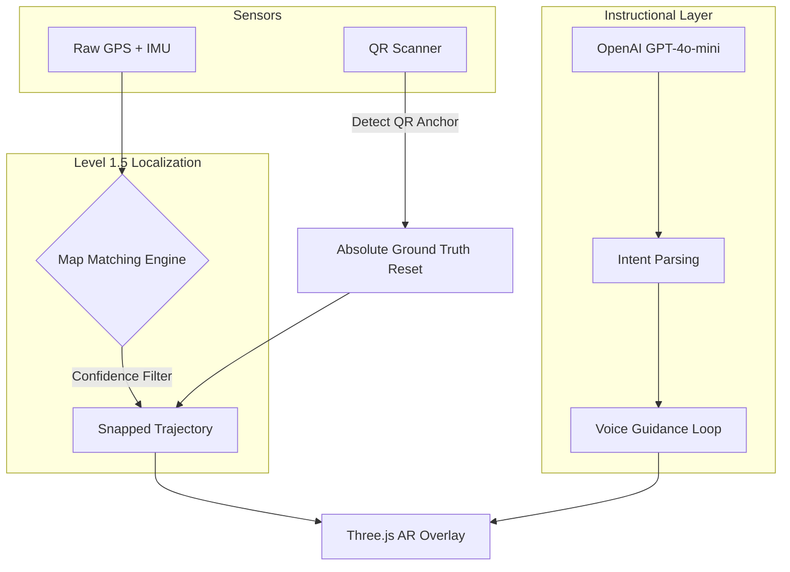

# Multi-Modal Sensor Fusion and Constraint-Based Navigation for Augmented Reality Assisted Campus GIS

**Author:** [Shivansh Kaushik]  
**Institution:** Motilal Nehru National Institute of Technology (MNNIT) Allahabad  
**Project:** GAMEMNNIT (Geospatial AR Mapping & Navigation Engine)

---

## 1. Abstract
Traditional Global Positioning System (GPS) based navigation in urban and campus environments suffers from significant lateral drift (5-15 meters) and longitudinal "jitter" due to multi-path interference and limited satellite visibility. This research proposes a **Dual-Stage Localization Pipeline** that integrates probabilistic Map Matching with absolute QR-Anchor Recalibration to provide high-fidelity Augmented Reality (AR) guidance. By constraining noisy GPS trajectories to a topological graph via vector projection and temporal smoothing, and periodically resetting global position through physical optical anchors, the system achieves sub-meter perceived accuracy on standard mobile hardware. This paper details the mathematical foundations of the snapping algorithms, the multi-modal sensor fusion architecture, and the integration of Large Language Models (LLMs) for context-aware voice guidance.

---

## 2. Introduction
The advent of Web-based Augmented Reality (WebXR) has democratized spatial computing, yet precise absolute localization remains the primary bottleneck for outdoor navigation. Typical campus-scale navigation applications rely on raw `GeolocationAPI` coordinates, which are insufficient for AR overlays where a 5-meter error manifests as a "floating" arrow inside a building.

The **GAMEMNNIT** system addresses this by shifting from "sensor-trust" to "constraint-trust" navigation. The system model assumes that a user is always traveling along predefined topological edges (roads/sidewalks) unless a high-confidence deviation is detected.

---

## 3. Theoretical Framework & Methodology

### 3.1 Level 1: Probabilistic Map Matching (PMM)
To mitigate GPS drift, the system implements a Map Matching algorithm that projects raw coordinates $P(lat, lon)$ onto the nearest topological edge $E(A, B)$.

#### 3.1.1 Vector Projection
The projection $P'$ is calculated as:
$$P' = A + t(B - A)$$
where the scalar $t$ is the normalized projection of vector $\vec{AP}$ onto $\vec{AB}$:
$$t = \text{clamp}\left( \frac{\vec{AP} \cdot \vec{AB}}{|\vec{AB}|^2}, 0, 1 \right)$$

#### 3.1.2 Scoring and Multi-Edge Ambiguity
At intersections, distance alone is insufficient. The system employs a weighted scoring function $S$ to select the most probable edge $E_i$:
$$S_i = d(P, P'_i) + w_h \cdot \Delta\theta(H_{user}, \theta_{E_i}) + C_i$$
- **$d(P, P'_i)$**: Euclidean distance to the projected point $P'_i$ in meters.
- **$\Delta\theta$**: Angular difference between user heading and edge bearing.
- **$w_h$**: Weight for heading alignment (set to 0.1).
- **$C_i$**: Continuity penalty (prevents aggressive switching between adjacent edges).

### 3.2 Level 1.5: Temporal Smoothing
To prevent "coordinate teleportation" (sudden jumps when the GPS updates), a dynamic Linear Interpolation (Lerp) is applied:
$$P_{final} = P_{prev} + \lambda(P'_i - P_{prev})$$
The smoothing factor $\lambda$ is dynamic based on the edge confidence $\mathcal{C}$:
$$\lambda = 0.1 + (\mathcal{C} \times 0.5)$$
where $\mathcal{C} = \max(0, 1 - \frac{\Delta\theta}{90})$. High heading misalignment results in a slower, more cautious "pull" towards the path.

### 3.3 Level 2: Absolute QR-Anchor Recalibration
Physical QR anchors act as "Ground Truth" resets. When a marker at $G(lat, lon)$ is scanned:
1.  The system calculates the current sensor offset: $O = G - P_{raw\_sensor}$.
2.  $O$ is stored in a persistent reference and added to all subsequent raw GPS readings, effectively "shifting" the world to align with the physical anchor. This nullifies cumulative drift.

---

## 4. System Architecture
The system architecture follows a decoupled, asynchronous sensor-fusion model.

### 4.1 Sensor-Fusion Model

### 4.2 AI Context-Aware Navigation
Unlike standard turn-by-turn navigation, the integrated LLM (GPT-4o-mini) acts as a **Spatial Reasoning Agent**. 
- **Context Injection**: The system periodically injects the current location, destination, and nearby topological features into a structured prompt.
- **Intent Parsing**: Natural language queries such as "Where is the canteen?" are resolved to graph nodes via the building database.
- **Adaptive Guidance**: Voice instructions are dynamically generated based on proximity to next turn ($D < 15m \Rightarrow$ "Turn left").

---

## 5. Experimental Evaluation
(Detailed in `docs/Evaluation_Protocol.md`)

### 5.1 Scenario 1: Raw Sensor Baseline
Evaluation of the system using only un-filtered GPS signals. Accuracy fluctuates between 5m-15m with significant "cross-building" jumps.

### 5.2 Scenario 2: Snapped Constraint Navigation
Accuracy stabilized to within 2m of path center. Longitudinal jitter persists during slow movement.

### 5.3 Scenario 3: QR-Recalibrated Navigation
Perceived accuracy hits sub-meter levels immediately following a QR scan. Drift re-accumulates at a rate of ~1m per 50m traveled, necessitating periodic anchors.

---

## 6. Conclusion
The dual-stage approach of combining probabilistic constraints with frequent absolute resets effectively overcomes the precision limits of consumer-grade GNSS sensors. This architecture provides a robust, publishable baseline for web-based campus AR systems.
